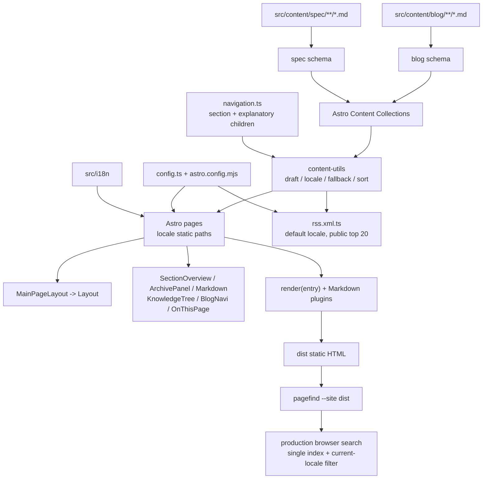

# 当前博客风险修复实施计划

## 概述

### Feature Description

修复当前博客中已由源码核对确认的架构不一致和运行边界问题，覆盖内容集合与 frontmatter、文章脚手架、草稿可见性、locale 路由与语言回退、导航子目录、分页遗留、Pagefind 搜索、RSS 链接和项目上下文文档。目标是让 README 中描述的内容模型和公开行为与实际实现保持一致，并减少未接入代码继续制造误导或维护成本。

本计划只描述后续实现，不在本轮创建或切换 Git 分支。计划分支名记录为：`feat/risk_remediation`。

### User Benefits

- 新文章脚手架生成的 frontmatter 可以直接通过 blog schema。
- 草稿在所有环境都不会进入公开列表、详情路由、RSS 或 Pagefind 索引。
- 中文和英文页面的内部链接、语言切换、文章回退和分类链接行为一致。
- 导航中的目录入口不再指向与子目录无关的同一个分类结果。
- 搜索加载失败、首次输入过快、跨 locale 重复结果等边界更明确。
- 分页配置和未接入旧组件不再与当前“知识库首页 + 全量归档”设计冲突。
- README 和 `.ai_docs/project_overview.md` 能准确描述实际架构与已确认边界。

### Project Alignment

- 保持 Astro 静态生成、Svelte 仅承担客户端交互、Markdown 作为内容源的现有架构。
- 复用 `src/utils/content-utils.ts`、`src/utils/url-utils.ts`、现有 i18n 和 Pagefind，不新增依赖。
- 不削弱现有 draft 过滤、Markdown 清洗、评论开关和可访问性结构。
- 不新增 hash、baseline、冻结 contract 或额外测试框架；通过 `astro check`、生产构建和手工验证获得证据。

### 计划分支名称

`feat/risk_remediation`

## 需求分析

### Functional Requirements

1. 内容集合
   - 为 `spec` 集合增加与现有文件一致的最小 schema，至少约束 `title: string`。
   - 保持 blog 现有字段为 `title`、`pubDate`、`description`、`image`、`slugId`、`category`、`draft`、`pinTop`，不引入不必要的兼容字段。
   - 明确 locale 文件名约定为 `zh-cn.md` 和 `en.md`，按文章目录去除语言文件名后形成文章路由 ID。

2. 新文章脚手架
   - 将 `script/newpost.js` 生成的 `date`/`slug` 改为 schema 使用的 `pubDate`/`slugId`。
   - `slugId` 作为独立稳定外部 ID 生成，文章目录移动时不自动改写；现有 `slugId` 不迁移。
   - 生成 README 所示的最小可用 frontmatter；`category` 可以为空，但不得生成 schema 不认识的键。
   - 保留语言参数校验和“文件已存在不覆盖”的行为。
   - 强制在任何 `mkdir`/文件写入前校验文章目录路径必须位于 `src/content/blog` 下，拒绝 `..`、绝对路径、驱动器路径、空片段和保留语言文件名等非法参数，避免命令参数造成越界写入。

3. 草稿可见性
   - 所有环境都排除 `draft: true`，确保公开列表、详情静态路径、RSS 和 Pagefind 均不包含草稿。
   - 仅保留公开查询接口，不提供 `includeDraft` 或开发专用 draft 查询；详情页中的不可达 draft 提示应删除或改写为不会暗示可预览。

4. 分页遗留
   - 核对后续目标：当前首页由 `SectionOverview.astro` 展示各顶级分类及最近文章，归档页由 `ArchivePanel.svelte` 展示全部条目，`siteConfig.pageSize`、`PostPage.astro`、`Navi.astro` 未接入主调用链。
   - 本次默认不删除 dirty worktree 中已修改的 `src/config.ts`、`PostPage.astro` 或 `Navi.astro`；先清理有效调用链中的无效引用并记录遗留文件，删除动作须在逐文件 diff 审计和用户授权后执行。分页重新接入另行作为扩展方案。
   - 本 feat 不重新接入分页；`pageSize`、`PostPage.astro`、`Navi.astro` 作为后续独立清理项保留。

5. locale 路由与回退
   - 保持 Astro 配置中的 `zh-cn` 默认 locale 不带前缀、`en` 带 `/en` 前缀。
   - 所有页面内部链接统一经过 `getRelativeLocaleUrl` 或等价的现有 URL 工具，修复首页归档链接、Footer RSS、文章上下篇等硬编码根路径在 locale/base URL 下的风险。
   - 采用可验证的 locale 路由政策：双语文章切换保留逻辑文章 ID；英文缺失时英文页回退中文并标记 `isFallback`；目标文章版本不存在时语言切换回目标 locale 首页；默认中文列表不展示仅英文文章。
   - `getSpec` 继续按目标 locale → 默认 locale 读取；`about`/`friends` 切换保持页面语义路径。
   - `getSpec` 继续按目标 locale → 默认 locale 读取，并让 spec 页面在 schema 约束下保持可渲染。

6. 导航子目录
   - 解决 `NavigationChild` 当前所有 `path` 都只过滤顶级 `category`、没有内容字段对应子目录的问题。
   - children 仅作为说明性内容展示，不提供虚假的筛选链接。
   - 本 feat 不增加 `topicId`，不修改 blog schema、CMS 或归档查询参数。

7. 搜索与 Pagefind
   - 保持 `pnpm build` 的 `astro build && pagefind --site dist` 链路及现有 `pagefind.yml` 排除规则。
   - 生产环境首次打开搜索时才加载 Pagefind；搜索输入应等待加载 promise，避免首次点击后立即输入时误报“不可用”。
   - 只保留一套搜索初始化/事件绑定，避免 Astro transitions 后重复监听，并避免每次查询无条件 `destroy/init`。
   - 使用单一 Pagefind 索引，但在结果展示阶段按当前 locale 过滤，避免 `/` 与 `/en/` 结果重复。
   - spec 保持进入搜索；通过构建后关键词验证 About/Friends 页面仍可搜索。

8. RSS
   - RSS 继续输出默认 locale 的前 20 篇公开文章，这是当前单一 `/rss.xml` 设计，不新增英文独立 feed。
   - RSS 条目链接统一使用现有 URL helper 或等价根路径 URL；项目明确只支持域名根路径，不承诺非根 base path 部署。
   - RSS 不得包含 draft；链接 ID 与文章详情静态路由一致。

9. 文档同步
   - 更新 README 中脚手架字段、draft 全环境隐藏、分页实际状态、locale fallback、导航说明、根路径部署限制和搜索构建说明。
   - 修正 `.ai_docs/project_overview.md` 中“blog/spec 都有 frontmatter 校验”的失真描述，并保留“AI 初稿、待维护者确认”的文档状态语义。
   - 文档只记录已经由代码和验证确认的事实；上述产品选择作为本 feat 的已确认范围记录。

### Non-Functional Requirements

- 不新增运行时或构建依赖。
- 保持静态站点部署方式和现有页面路由形态；除明确的 locale/base URL 修复外，不引入重定向层。
- 公开构建不能泄露草稿内容或草稿搜索索引。
- 页面端不因搜索或 locale 处理引入不必要的全量客户端数据请求；文章内容仍在构建期生成。
- 维护现有键盘焦点、语义链接、移动端导航和评论可选加载行为。
- 实现后必须按项目规则记录实际执行的 `pnpm exec astro check`、`pnpm build` 和手工测试结果。

### Edge Cases

- 只有中文、只有英文、同时存在两种语言、某种语言 frontmatter 不完整的文章。
- `draft: true` 文章在开发预览和生产构建中的差异。
- `category` 缺失、导航 children 为空或只包含说明性内容。
- 文章目录名包含空格、嵌套路径、`..`、绝对路径或与语言文件名约定不符。
- 当前 locale 搜索无结果、Pagefind 尚未加载、Pagefind 加载失败、结果包含重复 locale 页面。
- `PUBLIC_SITE_URL` 为空、包含 base path 或 RSS 在非根路径部署。
- 文章数量为 0、少于/多于 pageSize、跨年份归档、查询参数含中文或多个 category/topic。
- 英文页面回退中文文章后，语言切换和文章上下篇不得指向错误语言或不存在的路径。

### Dependencies

- Astro 7 i18n 与 `Astro.currentLocale`/`astro:config/client`。
- Astro Content Collections 的 glob loader、`getCollection`、`getEntry`、`render`。
- 现有 `src/utils/content-utils.ts` 与 `src/utils/url-utils.ts`。
- Svelte 5 的 `ArchivePanel.svelte` 客户端筛选。
- Pagefind 1.4 的构建产物与浏览器模块加载。
- `@astrojs/rss` 和 `Astro.site`。
- 无新增 npm/pnpm 依赖。

## 技术设计

### Architecture Overview

内容仍由 Markdown 作为源数据，经 Content Collections 校验后由 `content-utils` 做 draft、locale、回退和排序处理；页面入口负责静态路径和页面组合，布局负责站点外壳，组件负责视图，少量 Svelte 负责归档筛选，生产构建完成后由 Pagefind 扫描 HTML。



### Component Breakdown

#### 内容与查询层

- `src/content.config.ts`：blog schema 保持现有字段；spec 增加最小 title schema；不增加 `topicId`。
- `src/utils/content-utils.ts`：集中处理公开可见性、语言版本分组、默认语言 fallback、排序；不让页面重复实现这些规则。
- `src/content/navigation.ts`：保留顶级 section，将 children 收窄为说明性内容，不再伪造二级筛选链接。

#### 页面与布局层

- `src/pages/[...locale]/[...page].astro`：保持首页 locale 静态路径，不接入分页。
- `src/pages/[...locale]/blog/[...id].astro`：只从符合当前环境可见性规则的条目生成详情路径，保证 prev/next 与当前 locale 集合一致。
- `src/pages/[...locale]/archives.astro` + `src/components/ArchivePanel.svelte`：继续服务端准备排序条目、客户端筛选 category；不把全量 Markdown 内容搬到浏览器。
- `src/components/Header.astro`、`Footer.astro`、`BlogNavi.astro`：统一内部 URL 生成；语言切换依据当前路径和目标 locale 可用性处理，且只验证根路径部署。
- `src/components/misc/Search.astro`：拥有搜索弹窗及 Pagefind 加载/查询生命周期，使用单索引并按当前 locale 过滤，避免 Header 和 Search 各自维护一套 Pagefind 状态。

#### 脚手架与文档层

- `script/newpost.js`：仅负责校验参数、创建目录和写入符合 schema 的 Markdown 模板。
- `README.md`、`.ai_docs/project_overview.md`：同步已经落地的 schema、路由、搜索、草稿和分页事实。

### Data Flow

#### 文章列表与详情

```text
glob loader
  -> CollectionEntry<'blog'>
  -> getBlogEntrySort(lang, visibility policy)
  -> group by directory ID + filename locale
  -> select target locale or default fallback
  -> sort pubDate descending
  -> 首页 SectionOverview / 归档 ArchivePanel / 详情 getStaticPaths
```

详情页在 `getStaticPaths` 中使用同一 locale 条目集合生成 `id`，再由 `render(entry)` 进入 remark/rehype 插件链，产出正文、标题目录、字数和阅读时间。

#### Search/Pagefind

```text
pnpm build
  -> astro build
  -> 只生成公开文章路径
  -> pagefind --site dist
  -> dist/pagefind

生产用户打开搜索
  -> Search 等待单例 Pagefind loader
  -> pagefind.search(query)
  -> 按当前 locale 过滤 result.data().url
  -> 渲染标题、摘要和链接
```

#### RSS

```text
GET /rss.xml
  -> getBlogEntrySort(defaultLocale, production visibility)
  -> slice(0, 20)
  -> 生成 default-locale article links
  -> @astrojs/rss
```

### Configuration Changes

- 默认不新增配置项。
- 保留 `SiteConfig.pageSize` 及分页遗留组件，明确其未接入当前页面，后续另立清理任务。
- `astro.config.mjs` 保持当前根路径部署策略、locale、Markdown 插件和 Pagefind 构建命令不变。
- `pagefind.yml` 保持现有排除选择器；spec 继续进入索引，搜索结果按当前 locale 过滤。

### API/Interface Definitions

#### Blog schema（维持现有字段）

```ts
const blogSchema = z.object({
  title: z.string(),
  pubDate: z.coerce.date(),
  description: z.string().optional().default(""),
  image: z.string().optional().default(""),
  slugId: z.string(),
  category: z.string().optional(),
  draft: z.boolean().optional().default(false),
  pinTop: z.number().optional().default(0),
});
```

#### Spec schema

```ts
const specSchema = z.object({
  title: z.string(),
}).strict();
```

本次 spec contract 只承诺 `title`；未知 frontmatter 字段在构建期报错，不静默剥离。若未来 CMS 需要向 spec 写入其他字段，应另行扩展 schema 和验证范围。

#### 查询接口设计

当前没有调用方传入 `filter`/`sort`；为避免调用方绕过 draft 保护，只保留公开接口和一个非导出的共享实现。公开接口不接受 `includeDraft`，所有环境都只返回公开集合：

```ts
type BlogQueryOptions = {
  filter?: (entry: CollectionEntry<"blog">) => boolean;
  sort?: (a: CollectionEntry<"blog">, b: CollectionEntry<"blog">) => number;
};

getBlogEntrySort(lang: string, options?: BlogQueryOptions) // public only
```

内部共享函数先应用公开 visibility 条件，再与业务 `filter` 做 AND 组合。不要保留可由任意页面传入的 `includeDraft` 选项。

## 实施策略

### Implementation Phases

#### Phase 0：基线核对和决策冻结

1. 记录当前 `git status --short` 和涉及文件的 `git diff`，保留当前工作区已有未提交改动，不执行 reset、checkout 或覆盖操作。
2. 冻结已确认的产品边界：所有环境隐藏 draft、根路径部署、独立稳定 `slugId`、说明性二级导航、单索引当前 locale 搜索、spec 可搜索、`pinTop` 不影响前台排序。
3. 确认分页保持遗留并延期清理；本 feat 不删除 dirty 文件、不重做首页分页。
4. 核对 Astro 7 当前 `getStaticPaths`、Pagefind 1.4 和 `@astrojs/rss` 的实际 API；不得把未选方案写成公共接口。

#### Phase 1：内容模型和脚手架

1. 在 `src/content.config.ts` 增加 `spec` 的严格 `title` schema，不增加 `topicId`。
2. 更新 `script/newpost.js` 的 frontmatter 字段和默认值；生成独立稳定 `slugId`，并在任何 `mkdir`/写入前完成路径越界防护。
3. 更新 README 的写作模板和字段说明。
4. 使用隔离且可清理的临时样本验证中文、英文和可选字段；测试结束只删除本次明确创建的文件。

#### Phase 2：统一可见性、locale 和 URL

1. 调整 `getBlogEntrySort` 的 draft policy 和 locale grouping，保证所有调用点都不会绕过 draft 过滤。
2. 调整文章详情 `getStaticPaths`、prev/next、首页、归档和 RSS，全部使用同一公开/开发集合。
3. 修复 Header 语言切换、首页归档链接、Footer RSS、BlogNavi 等硬编码 URL，并验证默认 locale、英文 locale 和根路径 URL。
4. 处理目标语言无对应文章时的语言切换策略；保留英文 fallback 的 `isFallback` 提示，默认中文列表不展示仅英文文章。

#### Phase 3：导航和分页边界

1. 移除子目录的虚假筛选链接，改为说明性展示，并更新 README/overview。
2. 保留 dirty worktree 中的 `pageSize`、`PostPage.astro`、`Navi.astro`，只记录其未接入状态；不删除、不重新接入分页。

#### Phase 4：搜索与 RSS

1. 将 Pagefind 加载和搜索初始化收敛到 Search 的单一生命周期，使用可等待的单例 loader，处理 loading、error、空查询和 transitions。
2. 对规范化 URL 做当前 locale 过滤；对标题和 URL 使用安全 DOM 节点/站内 URL 校验，对摘要保留受控的 Pagefind `<mark>` 高亮或安全转义；spec 继续纳入索引。
3. 修复 RSS 条目 URL、Layout alternate RSS 和 Pagefind script URL 的根路径 policy，并确认 default-locale-only 语义。

#### Phase 5：文档、检查和验收

1. 更新 `.ai_docs/project_overview.md` 的 schema、调用链、分页状态、locale fallback、CMS/CLI 写入边界和 Pagefind 描述。
2. 运行 `pnpm exec astro check`。
3. 运行 `pnpm build`，确认 `dist/pagefind`、公开文章路由、RSS 和草稿排除结果。
4. 运行 `pnpm preview`，执行手工测试矩阵并记录实际结果。

### File Structure Changes

#### 预计修改文件

- `src/content.config.ts`：spec schema；不增加 `topicId`。
- `src/utils/content-utils.ts`：draft policy、locale fallback、查询接口。
- `src/utils/url-utils.ts`：locale/base URL 辅助逻辑（仅在现有函数不足时调整）。
- `src/content/navigation.ts`：二级导航路径与 ID 对应，或收窄为说明项。
- `src/pages/[...locale]/[...page].astro`：保持当前首页，不接入分页。
- `src/pages/[...locale]/archives.astro`：向归档组件传递必要筛选数据（如需要）。
- `src/pages/[...locale]/blog/[...id].astro`：详情路径、上下篇、分类 URL、可见性。
- `src/pages/rss.xml.ts`：公开条目和 URL 生成。
- `src/components/Header.astro`：语言切换和 Pagefind 触发边界。
- `src/components/Footer.astro`：RSS/base URL。
- `src/components/control/BlogNavi.astro`：locale/base URL。
- `src/components/misc/Search.astro`：Pagefind 单例加载、locale 过滤和事件生命周期。
- `src/components/ArchivePanel.svelte`：仅维护现有 category query 筛选。
- `src/components/knowledge/KnowledgeTree.astro`、`src/components/knowledge/SectionOverview.astro`：将二级 children 改为说明性展示。
- `src/config.ts`、`src/types/config.ts`：保留 `pageSize`，不接入分页。
- `src/components/PostPage.astro`、`src/components/control/Navi.astro`：本次默认不删除，保留为已确认未接入的遗留；删除须另行完成 dirty diff 审计并获授权。
- `script/newpost.js`：模板字段和路径参数校验。
- `README.md`：用户写作、草稿、路由、搜索和分页说明。
- `.ai_docs/project_overview.md`：当前架构事实同步。
- `cms/server/store.mjs`、`cms/server/articles.mjs`、`cms/src/pages/new-article.ts`、`cms/smoke.mjs`：作为双写入契约和手工验证对象；本 feat 默认不修改 CMS，验证独立稳定 `slugId`、draft 和路径安全边界。

#### 明确不修改

- 不修改现有文章正文或 spec 内容文件；如需验证 draft/topic，使用临时样本并在验证后删除，或使用不纳入提交的工作区样本。
- 不修改评论后端、Markdown 插件实现和主题样式。CMS 默认不修改，但必须验证其创建、保存、移动、draft 和 schema 字段契约；本 feat 不引入 `topicId`，`slugId` 保持独立稳定 ID。
- 不创建分支、不提交、不推送、不创建 PR。

### Code Locations

| 风险 | 代码位置 | 证据 | 计划方向 |
|---|---|---|---|
| spec schema 缺失 | `src/content.config.ts` / `specCollection` | spec 只有 glob loader，无 schema | 增加 `title` 最小 schema |
| 脚手架字段错误 | `script/newpost.js` / `defaultContent` | 生成 `date`、`slug`，schema 要求 `pubDate`、`slugId` | 直接改为 schema 字段 |
| draft 提示不可达 | `src/utils/content-utils.ts` / `getBlogEntrySort`；文章页 draft note | 默认始终 `data.draft !== true`，详情路径使用该结果 | 所有环境隐藏 draft，移除或改写不可达提示 |
| 分页遗留 | `src/config.ts`、`src/types/config.ts`、`PostPage.astro`、`Navi.astro` | `rg` 仅见定义/组件内部引用，主页面未导入 | 本次保留并记录，另立清理任务 |
| locale/base URL 不一致 | `Header.astro`、首页、`Footer.astro`、`BlogNavi.astro` | 存在硬编码 `/`、`/en/` 和 `/blog` 链接 | 统一现有 URL 工具 |
| 子目录无内容映射 | `src/content/navigation.ts`、`SectionOverview`、`KnowledgeTree`、`ArchivePanel.svelte` | child path 仅重复顶级 category，blog schema 无子目录字段 | 收窄为说明性 children，不增加 `topicId` |
| Pagefind 生命周期/语言范围 | `Header.astro`、`Search.astro`、`pagefind.yml` | Header 懒加载、Search 查询时 destroy/init，未按 locale 过滤 | 单例 loader、等待加载、当前 locale 过滤 |
| 文档漂移 | `README.md`、`.ai_docs/project_overview.md` | overview 声称 spec 有校验，实际没有；分页描述未反映未接入状态 | 实现后同步已确认边界 |

### Integration Points

- Content schema 变化会影响 Astro content type inference、`getSpec`、`render` 和构建期错误。
- `getBlogEntrySort` 变化会同时影响首页、归档、文章详情路径、知识树、上下篇和 RSS。
- URL 工具变化会影响默认 locale、英文 locale、文章链接、分类查询、RSS 和根路径部署。
- 二级导航收窄只影响 navigation、SectionOverview 和 KnowledgeTree 的展示，不改变 Markdown frontmatter、ArchivePanel URL 或 CMS schema。
- Pagefind 变化依赖 Astro 先完成构建；不能在 dev server 中把“无索引”误判为构建失败。

## 测试计划

项目当前没有专门自动化测试脚本；按测试规则默认采用命令检查、生产构建和浏览器手工验证，不新增测试框架。

### Test scenarios

1. 静态检查
   - 实施前保存 `git status --short` 和相关 `git diff`；测试样本不得复用已有 modified/deleted/untracked 文件路径。
   - `pnpm exec astro check`：schema、Astro props、Svelte props 和 URL 工具类型无错误。
2. 构建检查
   - `pnpm build`：Astro 构建和 Pagefind 均成功，`dist/pagefind` 存在。
   - 检查公开文章路由数量；确认 draft 不生成详情路由、不出现在 HTML 和 Pagefind 索引。
   - 检查 `/rss.xml` 内容只包含默认 locale 的公开前 20 篇，链接可解析。
3. locale 路由
   - 访问 `/`、`/en/`、`/about`、`/en/about`、`/archives`、`/en/archives`、对应 blog 路由。
   - 同时有中英文文章时检查各自标题；只有中文时检查英文 fallback 提示；只有英文时确认默认中文列表不展示、英文列表正常展示。
   - 从文章页切换语言，确认目标存在时保留对应文章，目标不存在时进入约定的安全 fallback 页面。
4. 草稿
   - 在唯一临时样本中设置 `draft: true`；确认 `pnpm dev`/`pnpm build`/`pnpm preview` 均不生成详情、列表、RSS 和 Pagefind 结果。清理时只删除本次创建的明确路径。
   - 使用一个附加业务 filter 的查询调用验证：公开查询仍不能返回 draft，且不存在开发专用 draft 查询接口。
5. newpost
   - 执行 `pnpm newpost <nested/path> zh-cn` 和 `pnpm newpost <nested/path> en`，确认生成 `pubDate`/`slugId` 且可通过 schema。
   - 重复执行确认不覆盖；非法 locale、`..`、绝对路径、驱动器路径和空/保留片段确认在 `mkdir` 前失败且不写出内容目录。
   - 按独立稳定 `slugId` 决策验证 CLI 与 CMS 的新建、保存、移动和评论标识行为；默认使用现有 `cms/smoke.mjs` 做只读/隔离验证，不修改 CMS。
6. 导航/归档
   - 顶级 category 筛选、无 category、跨年份归档、刷新和前进后退状态。
   - 二级 children 仅作说明性展示，不产生 topic 筛选链接；顶级 category 筛选、中文 query URL 和空分类行为正常。
7. 搜索
   - 生产预览首次点击搜索、立即输入、重复打开/关闭、Astro 页面切换、空查询、无结果和加载失败。
   - 验证 spec 可搜索；中文 locale 不显示英文重复结果，fallback 文章按已确认策略展示。
   - 搜索结果链接只允许站内规范化 URL；标题/摘要中的 `<script>`、``、引号和特殊字符不会破坏结果 DOM，摘要高亮仍可用。
8. RSS/base URL
   - 使用默认 `PUBLIC_SITE_URL` 和配置了站点 URL 的构建，检查 canonical/RSS/文章链接。
   - 按根路径-only 政策验证 RSS item、alternate RSS、Pagefind script、locale 和文章链接，并在 README 明确不支持非根 base path。
9. CMS 双写入契约
   - 验证 CMS 新建/保存产生的 frontmatter 能通过当前 schema，draft 状态、locale 文件名和 `slugId` 行为与 CLI 一致或符合已记录的差异。
   - 验证 CMS 移动/改 slugId 不会把文章写出 `src/content/blog`，不会无意改变外部评论标识；无法证明时不得宣称契约已闭合。
10. 回归
   - 文章正文的 KaTeX、提示块、图片、TOC、上下篇、评论关闭状态和移动端导航无回归。

### Test data and expected results

| 数据 | 预期 |
|---|---|
| 现有 `tech/getting-started/zh-cn.md` | 默认 locale 列表、英文 fallback、文章详情和 RSS 均可用 |
| 同目录临时 `en.md` | `/en/blog/tech/getting-started` 使用英文内容；中文页使用中文内容 |
| 临时 `draft: true` | dev、build、preview 的 HTML、详情路径、RSS、Pagefind 均排除 |
| 导航 children | 只呈现说明性文本，不生成 topic 筛选链接 |
| 无 `category` 文章 | 顶级归档仍可显示未分类文章 |
| `pnpm newpost` 输出 | frontmatter 字段与 schema 完全一致，生成文件可被 collection loader 读取 |
| Pagefind 无索引或加载失败 | 用户看到明确提示，页面不抛出未处理异常 |

## 验收标准

### Success Metrics

- [ ] `src/content.config.ts` 的 blog/spec schema 与实际内容、README 和脚手架一致。
- [ ] `pnpm newpost` 生成的文章不再使用失效的 `date`/`slug` 字段。
- [ ] 所有环境不包含 draft 的详情、列表、RSS 和 Pagefind 结果。
- [ ] 默认 locale、英文 locale、fallback、语言切换和所有主要内部链接通过手工验证。
- [ ] 二级导航已收窄为无链接说明项，不保留未定义筛选语义的入口。
- [ ] 分页未被部分接入；本次不删除 dirty 文件，失效遗留状态和后续清理边界已记录。
- [ ] Pagefind 生产构建成功，搜索加载/错误/locale 边界通过验证，未新增重复初始化。
- [ ] RSS 仅包含公开默认 locale 文章，链接在目标部署 URL 下可用。
- [ ] `pnpm exec astro check` 和 `pnpm build` 的真实结果已记录。
- [ ] README 和 `.ai_docs/project_overview.md` 不再陈述已被源码否定的架构事实。
- [ ] CMS 双写入契约已按独立稳定 `slugId`/draft 决策完成验证；未修改 CMS 时已记录其未闭合边界。

### User Acceptance

- 维护者可以按 README 模板创建文章并直接构建。
- 访问者在中文和英文入口看到一致、可解释的文章列表和语言回退。
- 归档、搜索、文章详情、RSS 的数据集合边界一致，草稿不会进入生产公开面。
- 维护者能够从导航目录进入对应的真实筛选结果，或从文档明确知道当前只有顶级分类。
- 计划实施不会删除或覆盖当前工作区中与本 feat 无关的已有改动。

## 已确认的设计决策与冲突处理

以下事项已由维护者确认，后续实现不得重新引入未选择的替代方案：

1. 草稿：所有环境均排除 `draft: true`；不提供开发专用 draft 查询，不保留暗示可预览的详情提示。
2. 部署：只支持域名根路径；不扩展 Astro 非根 `base` 部署承诺，但所有根路径内部链接、RSS 和 Pagefind URL 仍统一验证。
3. `slugId`：保持独立稳定外部 ID；新文章生成时创建独立 ID，目录移动时不自动改写，现有值不迁移。
4. 二级导航：children 仅作说明性展示，不可点击；不增加 `topicId`，不扩展归档查询参数或 CMS schema。
5. Pagefind：保持单一索引，结果按当前 locale 过滤；不生成按语言拆分的索引。
6. spec 搜索：继续索引 About/Friends spec，并在构建后验证可搜索。
7. `pinTop`：仅作为 CMS/schema 字段，前台继续按 `pubDate` 排序。
8. 分页：保留 `pageSize`、`PostPage.astro`、`Navi.astro` 等遗留，不删除、不重新接入，另立清理任务。

### 历史备选方案（已不再作为待确认事项）

1. 二级导航的真实语义
   - 选项 A：增加可选 `topicId`，与 `NavigationChild.id` 对齐，并让归档支持 `category + topicId`（代价：frontmatter、归档、知识树和 CMS 契约一起变化；收益：目录成为真实筛选入口）。
   - 选项 B：不扩展 schema，将 children 改为纯说明项或移除链接（代价：没有二级筛选；收益：实现最小且不会伪造结果）。
   - 默认建议：B；当前没有证据表明近期需要二级主题管理。

2. 草稿是否允许开发预览
   - 选项 A：仅 `pnpm dev` 可生成 draft 详情，`pnpm build`/`pnpm preview` 完全排除（代价：需独立 development 查询接口和环境矩阵；收益：保留站内作者预览）。
   - 选项 B：所有环境均排除 draft，并删除/改写不可达提示（代价：失去站内预览；收益：静态安全边界最简单）。
   - 默认建议：B，除非维护者明确需要 `pnpm dev` 预览并接受额外验证。

3. 分页处理方式
   - 选项 A：本次保留 dirty 文件和未接入组件，仅记录遗留并另开清理任务（代价：短期仍有死代码；收益：不覆盖用户改动、不改变页面行为）。
   - 选项 B：完成 diff 审计后清理 `pageSize`、`PostPage.astro`、`Navi.astro`（代价：需用户授权和额外审计；收益：减少遗留）。
   - 选项 C：重新设计并接入真实分页（代价：改变首页信息架构、URL 和 SEO；收益：恢复分页能力）。
   - 默认建议：A；本次不删除 dirty worktree 文件。

4. 搜索范围
   - 选项 A：按当前 locale 过滤 Pagefind 结果（代价：需要 URL 规范化和 fallback 结果规则；收益：避免中英文重复页面）。
   - 选项 B：保留跨 locale 全站搜索，并在结果中显示语言标签（代价：新增语言标识、去重和排序规则；收益：跨语言内容发现更完整）。
   - 默认建议：A；与当前 locale 路由直觉一致。

5. 只有英文版本的文章在默认中文列表中的政策
   - 选项 A：默认中文列表只展示有 `zh-cn.md` 的文章；英文列表展示英文文章，中文缺失时不伪造中文 fallback（代价：中文入口发现不到仅英文内容；收益：保持默认语言内容基准）。
   - 选项 B：默认 locale 也展示英文原文并添加语言提示（代价：中文列表出现跨语言内容；收益：内容发现完整）。
   - 默认建议：A。

6. spec 是否进入搜索
   - 当前证据：`Markdown.astro` 同时包裹 blog 和 spec 正文，Pagefind 现有配置没有专门排除 spec。
   - 选项 A：继续索引 spec，并用构建后关键词验证（代价：搜索包含关于/友链页面；收益：保持现状、改动最小）。
   - 选项 B：只索引 blog，给 spec 页面增加明确 ignore（代价：需调整页面边界；收益：文章搜索语义更纯粹）。
   - 默认建议：A。

7. 项目是否正式支持非根 base path
   - 选项 A：支持 Astro `base`，统一处理页面 URL、RSS、Pagefind 资源和语言切换（代价：需配置和部署矩阵验证；收益：子路径部署完整）。
   - 选项 B：只支持域名根路径，在 README 明确限制（代价：放弃子路径部署；收益：范围最小、避免假设性修复）。
   - 默认建议：B，除非存在真实子路径部署需求。

8. `slugId` 的语义
   - 选项 A：与 CMS 新建规则一致，使用完整相对目录路径（代价：可能改变评论/外部标识；收益：CLI/CMS 目录规则一致）。
   - 选项 B：与目录解耦，CLI 要求或生成独立稳定 ID（代价：需要定义唯一性和迁移规则；收益：外部引用不随移动变化）。
   - 默认建议：B；当前现有文章的 `slugId` 已与目录 ID 不同，不能无证据改写其语义。

9. `pinTop` 是否影响前台排序
   - 选项 A：仅 CMS 管理/统计字段，明确不影响前台（代价：CMS 与网站排序仍不同；收益：不改变当前公开顺序）。
   - 选项 B：纳入共享排序，定义首页、归档、上下篇和 RSS 的置顶行为（代价：改变公开排序；收益：CMS 与前台一致）。
   - 默认建议：A，除非维护者有明确置顶产品需求。

## 显式假设

- 当前工作区源码和已读取文档是本计划的事实基线；工作区已有修改属于用户改动，不在实现时覆盖。
- `/rss.xml` 是全站单一默认语言 feed；没有新增 `/en/rss.xml` 的需求。
- 现有 `zh-cn`/`en` 文件名约定继续保留，文章路由 ID 由目录路径决定，而不是由 `slugId` 决定。
- 文章详情 URL 继续使用 collection ID；`slugId` 作为独立稳定外部 ID，生成和唯一性规则在脚手架/CMS 契约中明确，现有值不迁移。
- `pinTop` 仅作为 CMS/schema 字段，不改变当前前台仅按 `pubDate` 排序的行为，并在文档中标明 CMS/前台差异。
- 不新增自动化测试框架；命令检查、构建和手工验证足以覆盖本次静态站点边界。
- 项目只支持域名根路径；不把非根 base path 作为验收目标，根路径行为仍需正常验证。
- 本计划已将维护者确认的选择写入执行范围；历史备选方案仅用于保留决策溯源，不再构成待确认事项。

## Step 3 Reconcile：Challenge 逐条合并决策

本节是对 `.ai_docs/plan/current/risk_remediation.challenge.md` 的逐条处理结果，优先级高于前文未收窄的表述。`accept` 表示建议已纳入执行计划；`reject` 表示该建议或其替代方案不纳入本 feat，并记录理由；原 `escalate` 项已根据维护者确认转换为最终执行决策。

| Challenge | 处理 | 合并结论 |
|---|---|---|
| C1 draft 开发预览边界 | `accept` | 所有环境隐藏 draft；保留生产排除和 `pnpm dev`/`pnpm preview` 不生成 draft 的验收，移除开发专用查询分支。 |
| C2 查询接口可能绕过 draft | `accept` | 只保留公开查询接口，不提供 `includeDraft` 或开发查询接口；业务 filter 只能与公开 visibility 条件 AND 组合。 |
| C3 locale fallback 与切换政策 | `accept` | 按逻辑文章 ID 建立可用 locale URL；目标 locale 不存在时回目标 locale 首页；默认中文列表不展示仅英文文章。 |
| C4 非根 base path | `accept` | 冻结根路径-only 部署政策；页面链接、RSS、Pagefind 资源和语言切换统一按根路径验收，不承诺子路径部署。 |
| C5 Pagefind loader 与结果规范化 | `accept` | 使用单例可等待 loader、URL 规范化和当前 locale 过滤；不生成按语言拆分索引。 |
| C6 搜索结果 innerHTML 安全 | `accept` | 纳入独立安全要求：标题使用 DOM 文本节点，URL 做站内 allowlist/规范化，摘要仅保留受控 Pagefind 高亮；加入特殊字符和注入样本验收。 |
| C7 newpost 路径安全与 slugId | `accept` | 路径校验在任何文件系统操作前执行；`slugId` 生成独立稳定 ID，目录移动不自动改写，现有值不迁移。 |
| C8 spec schema 兼容性 | `accept` | 增加严格的 `title` schema，明确本次不承诺其他 spec frontmatter；未知字段构建期报错，不静默剥离，并验证四个现有 spec 文件。 |
| C9 topicId 数据完整性 | `accept` | 不增加 `topicId`；children 收窄为非链接说明项，不产生未知 topic、缺失 topic 或空结果筛选语义。 |
| C10 dirty worktree 与分页删除 | `accept` | 接受实施门禁：不删除或覆盖已修改/未跟踪文件；本 feat 默认不删除 `PostPage`/`Navi`，不从 dirty `config` 移除 `pageSize`，仅记录遗留并另开清理任务。 |
| C11 CMS 双写入契约 | `accept` | 将 CMS 作为实际内容写入方纳入契约验证；默认不修改 CMS，使用现有 CMS smoke/隔离验证，验证独立稳定 `slugId`、draft、schema 和路径安全边界。 |
| C12 RSS/base path 缺口 | `accept` | 将 RSS item link、Layout alternate link、Pagefind script URL 与根路径 policy 一起验收，不承诺非根部署。 |
| C13 spec 搜索范围 | `accept` | spec 继续进入 Pagefind，并要求构建后通过 About/Friends 关键词观察索引结果。 |
| C14 pinTop 前台语义 | `accept` | `pinTop` 仅作为 CMS/schema 字段，前台继续仅按 `pubDate` 排序并记录 CMS/前台差异。 |
| C15 测试基线与工作区保护 | `accept` | 接受安全基线、唯一临时样本、显式清单、定向清理、真实命令结果和构建产物检查；不新增测试框架。 |

### 已拒绝的建议或替代方案

以下不是对 challenge 事实的否定，而是对其提出的替代实现方案作出的范围决策：

1. 拒绝 C2 的“继续保留可传 `includeDraft` 的单一自由接口”方案：公开调用方容易误传配置而绕过 draft 保护，与代码规则中的安全默认和清晰边界冲突。
2. 拒绝 C5 的“按语言生成两套 Pagefind 索引”方案：当前没有语言隔离索引基础，新增构建产物和配置会扩大范围；采用单索引并按当前 locale 过滤。
3. 拒绝 C7 的“只修 frontmatter、不修路径安全”方案：已确认存在 `mkdir` 前缺少越界校验，不能以改字段替代安全修复。
4. 拒绝 C9 的“从现有目录路径自动推导二级主题”方案：当前 `tech/getting-started` 与 `web/ai` 导航 ID 没有可证明映射，自动推导会把文件夹结构与展示分类强耦合。
5. 拒绝 C10 的直接删除方案：当前 `src/config.ts`、`PostPage.astro` 等存在 dirty worktree 修改，`rg` 的无调用证据不足以授权不可逆删除。
6. 拒绝 C11 的跨 CLI/CMS 共享抽象方案：当前 feat 不需要引入跨根目录的共享模块；通过契约验证发现真实阻塞时再另立重构范围。
7. 拒绝 C15 的新增自动化测试框架方案：项目规则明确当前无专门测试脚本，且本次静态站点边界可由现有 check/build/preview 与安全临时样本覆盖。

### 已合并的可执行计划收窄

- draft：所有环境隐藏 draft，仅保留公开查询接口和生产排除验收。
- locale：采用统一逻辑文章 ID 和目标可用性判断；默认中文列表不展示仅英文文章。
- URL/base：冻结根路径-only；RSS、Pagefind 和页面链接按同一根路径政策验收。
- newpost：路径越界校验是强制步骤；`slugId` 使用独立稳定 ID，禁止迁移既有文章标识。
- 导航：移除子目录虚假筛选链接，children 仅作说明性展示，不增加 `topicId`。
- 分页：本次不做 dirty worktree 中的删除，不重新接入分页；失效组件保留并记录为后续清理项。
- 搜索：采用单例 loader、受控 DOM 渲染、单索引和当前 locale 过滤；spec 保持可搜索。
- CMS：默认只验证不修改；验证独立稳定 `slugId`、draft、schema 和路径安全契约。

### 决策状态

所有产品决策已确认，无待用户决策项；上方历史备选方案仅保留决策溯源。
