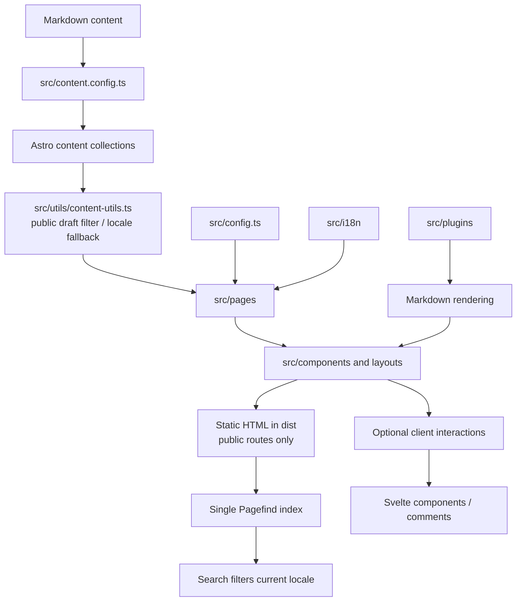

# 项目上下文：架构概览

状态：AI 初稿，待 wentZh2004 确认。确认前不得将本文中的建议当作强制规范。

## 项目用途

这是一个以知识库方式组织的个人博客，使用 Astro 生成静态站点，同时保留中文和英文路由、文章内容、搜索、RSS、KaTeX、评论和知识树等能力。

## 技术栈与运行方式

- Astro 7 + TypeScript，使用 Svelte 承担部分客户端交互组件。
- 内容位于 `src/content/blog` 和 `src/content/spec`，由 `src/content.config.ts` 定义集合；blog 校验文章字段，spec 当前严格校验 `title`。
- `pnpm build` 先执行 Astro 构建，再用 Pagefind 为 `dist` 生成搜索索引。
- `script/newpost.js` 提供新文章脚手架；`cms/` 是独立的 CMS 开发目录。

## 主要模块

### 页面、布局与组件

- `src/pages`：按 locale、列表、文章、关于、友链、归档和 RSS 组织页面入口。
- `src/layouts`：站点级页面布局和首页布局。
- `src/components`：导航、文章卡片、文章正文、知识树、目录、搜索、评论等可复用视图组件。

### 内容与导航

- `src/content.config.ts`：内容集合加载和 schema 校验；spec 的当前 contract 只有严格的 `title` 字段。
- `src/content/navigation.ts`：知识库顶级分类和说明性目录内容；children 不承担二级筛选语义。
- `src/utils/content-utils.ts`：读取、排序、公开过滤、locale fallback 和 spec 内容。

### 配置、国际化与工具

- `src/config.ts`：站点、个人资料、评论、主题和内容许可配置。
- `src/i18n`：语言 key、中文/英文翻译和 locale 处理。
- `src/utils`：URL、Markdown、时间、图片占位等辅助逻辑。

### Markdown 与样式

- `src/plugins`：remark/rehype 扩展、指令组件、阅读时间、图片和 Typst 处理。
- `src/styles`：全局、Markdown、主题变量和特殊组件样式。

## 主要数据流

## 边界与待确认项

- Astro 页面和组件默认负责静态生成；Svelte 仅用于确实需要客户端状态或交互的部分。
- 内容 frontmatter 是内容层与页面层之间的稳定接口；blog 使用完整 schema，spec 本次只承诺严格 `title`。
- 所有环境的公开查询都排除 draft；英文缺失时文章页回退中文，只有英文版本的文章不进入默认中文列表。
- 项目只支持域名根路径；RSS、页面内部链接和 Pagefind 资源按根路径约定生成。
- `script/newpost.js` 和 CMS 都生成/复用同一文章目录下各语言版本共用的稳定 `slugId`，文章路由仍由目录 ID 决定；既有文章的 `slugId` 不自动迁移。
- `pageSize`、`PostPage.astro` 和 `Navi.astro` 保留为未接入主调用链的分页遗留，不在本 feat 删除或重新接入。
- Pagefind 使用单一索引，spec 页面继续可搜索，结果展示时按当前 locale 过滤。
- 评论是可选运行时能力，不应成为静态文章构建的必要依赖。
- “是否允许新增组件层、工具层或依赖”仍需由项目维护者确认。
